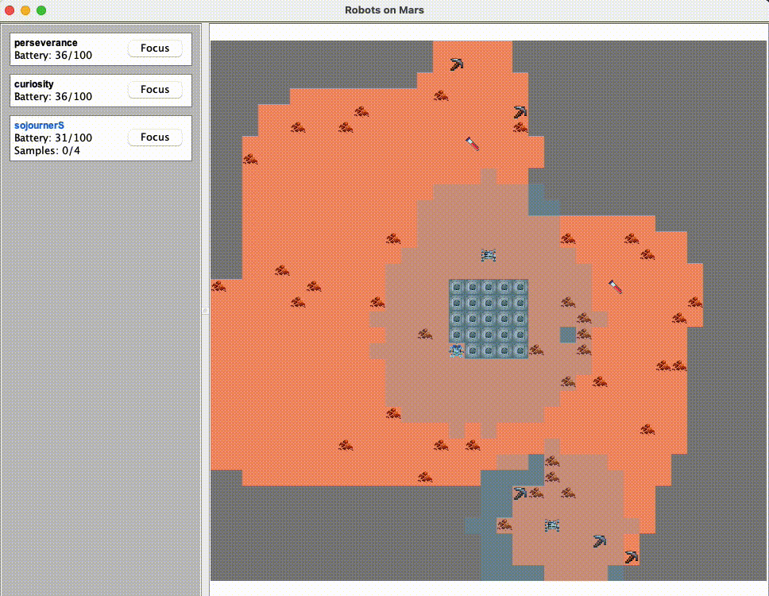

# Robots on Mars

- [Abstract](#abstract)
  - [Rovers](#rovers)
  - [Environment](#environment)
  - [Exploration](#exploration)
  - [Sample collection](#sample-collection)
  - [Energy management](#energy-management)
  - [Communication](#communication)
- [How to run it](#how-to-run-it)
  - [Configuration](#configuration)
- [Design](#design)
  - [Knowledge representation](#knowledge-representation)
  - [Exploration](#exploration-1)
    - [Exploration perception](#exploration-perception)
    - [Exploration movement](#exploration-movement)
  - [Communication](#communication-1)
    - [Emergent behaviour](#emergent-behaviour)
  - [Battery management](#battery-management)
  - [Samples collection](#samples-collection)
  - [Sample deposit](#sample-deposit)
    - ["Fast" deposit](#fast-deposit)
  - [Putting the goals together](#putting-the-goals-together)
  - [Critical performance optimization technique](#critical-performance-optimization-technique)
- [Testing](#testing)



On the left-hand side you can see all the roaming rovers and their properties.
By clicking the **Focus** button, the GUI will display only what that rover
actually knows.

On the right-hand side there is Mars. You can see:

- Rovers (scientists have slightly different sprites)
- Mining spots (represented by a pickaxe)
- Samples (represented by test tubes)
- Obstacles (represented by sprites that look like piles of poop)
- Base (the gray squares in the middle)
- Unknown areas (represented by gray cells)
- Antenna range (represented by a light blue overlay)

If you focus on a rover, you will only see what it sees and knows. You will be
able to see other rovers only if they are within its camera range.

## Abstract

This project aims to create a Jason MAS simulating the behaviour of multiple
robots exploring and collecting samples on Mars.

### Rovers

Some new rovers have just arrived on Mars to explore the planet. Their main
goals are:

- building a map of the area and marking all points of interest
- collecting samples of specific rocks, which may require drilling the terrain
- transporting samples to the main base, where they will be stored long term

Each rover is equipped with:

- a 360° camera
- wheels
- a short-range communication antenna
- a battery

Some of the rovers are "scientists" and are therefore also equipped with:

- drills for mining rock samples
- robotic arms to collect samples
- limited sample storage

### Environment

The environment is generated randomly and modeled as a grid in which each cell
can represent:

- a rover
- flat empty surface
- rock obstacle
- mining spot
- sample to collect
- base

### Exploration

Rovers should prioritize mapping areas closer to the base.

They can only move one cell at a time following the cardinal directions. While
moving, they also map the environment using their cameras.

### Sample collection

Some samples are immediately collectable, while others need to be drilled.

Mining spots only need to be drilled once. Rovers are able to recognise spots
that have already been drilled thanks to their cameras.

Each sample occupies the same amount of space in storage.

### Energy management

- moving has a relatively low energy consumption
- mining rocks consumes a lot of energy
- rovers can charge their batteries at the main base

### Communication

There is no network infrastructure, so rovers can exchange information only when
they are within antenna range.

The base is also equipped with an antenna and can store data, just like the
rovers.

## How to run it

```sh
jason robotsOnMars.mas2j
```

### Configuration

By editing the [robotsOnMars.mas2j](robotsOnMars.mas2j) file you can specify the
number of robots to instantiate. Rovers whose names end with an "S" are
scientists.

```
/* ... */
MAS robotsOnMars {

    environment: src.env.Env()

    agents:
        base base;

        curiosity rover;
        perseverance rover;
        sojournerS rover; /* Scientists end with an "S" */

    aslSourcePath: "src/agt";
}
```

There are multiple configuration parameters that can be edited directly in
[Config.java](src/model/Config.java).

```java
public final class Config {
    public static final int MARS_SIZE = 35;
    public static final float MARS_OBSTACLES_DENSITY = 0.05f;
    public static final float MARS_SAMPLES_DENSITY = 0.005f;
    public static final float MARS_MINING_SPOTS_DENSITY = 0.01f;
    public static final int MARS_BASE_SIZE = 4;
    public static final int MARS_BASE_ANTENNA_RANGE = 7;
    public static final int ROVER_BATTERY_CAPACITY = 100;
    public static final int ROVER_CAMERA_RANGE = 3;
    public static final int ROVER_ANTENNA_RANGE = 5;
    public static final int ROVER_MOVEMENT_ENERGY_COST = 1;
    public static final int ROVER_CHARGING_ENERGY_AMOUNT = 10;
    public static final int SCIENTIST_SAMPLES_CAPACITY = 4;
    public static final int SCIENTIST_MINING_SAMPLE_ENERGY_COST = 10;
    public static final int MOVEMENT_DURATION_MS = 1000;
    public static final int RECHARGE_DURATION_MS = 2000;
    public static final int MINE_SAMPLE_DURATION_MS = 3000;
    public static final int COLLECT_SAMPLE_DURATION_MS = 2000;
    public static final int DEPOSIT_SAMPLES_DURATION_MS = 500;
    public static final double RANDOM_MOVEMENT_PROBABILITY = 0.1;
}
```

## Design

To make the project easier to understand, we will cover each main aspect
separately, and then put everything together at the end.

### Knowledge representation

It is helpful to describe how some beliefs are represented in order to better
understand the following sections.

Rovers (as well as the base) store information about the Martian landscape in
the form of "cells". Each cell has coordinates, perceived terrain, and a
timestamp of perception.

```
cell(coord(X, Y), Terrain, Timestamp)
// X and Y are integers
// Terrain is one of: empty, base, sample, miningSpot, obstacle
// Timestamp is the UNIX timestamp
```

Coordinates are always represented as `coord(X, Y)`.

### Exploration

#### Exploration perception

While moving, the rover can see around itself and perceives optical information
about the environment.

Each time the rover sees a cell, it updates its belief about that cell. There is
no need to check previous information about the cell since there cannot be data
more up to date than what the rover is currently seeing.

```
+see(C, Terrain) <- +cell(C, Terrain, system.time).
// C represents the coordinates
```

> **Note:**
>
> We do not remove previous data about the cell because cells are not actually
> stored as pure beliefs for performance reasons. A complete explanation is
> provided [later](#critical-performance-optimization-technique)

#### Exploration movement

Exploration is implemented following a simplified Motor-Schemas control
architecture.

Imagine that the rover is immersed in a potential field that attracts it toward
unexplored regions. Unexplored regions that are closer to the rover attract it
with a stronger force.

This approach results in behaviour that is not segmented and therefore very
resilient and flexible.

Eventually, there will be no unexplored areas close to the base. This behaviour
emerges naturally: rovers eventually return to the base to recharge, and once
charged they are attracted to unexplored areas near the base.

```
+!explore : not(theresScienceToDo) <-
    exploreAction.
+!explore.
-!explore.
```

Computing this kind of behaviour is not trivial and therefore it was decided to
implement it Java-side (exploreAction).

```Java
// This function produces the best direction for the rover to explore
Optional<Direction> bestExploreDirection(Rover rover) {
    final var roverCoord = roverCoordinates().get(rover);
    final var knownCoord = rover.marsView().knownTerrain().keySet();
    final Function<Coordinates, Boolean> isBorder = coord -> coord.neighbours().stream()
            .filter(n -> isInsideBounds(n))
            .map(c -> knownCoord.contains(c))
            .anyMatch(hasKnownNeighbour -> hasKnownNeighbour);

    // Computing frontier unknown coordinates/cells
    final var unknownCoord = allCoordinates.stream()
            .filter(c -> !knownCoord.contains(c) && isBorder.apply(c))
            .toList();

    // Each of those coordinates/cells will attract the rover.
    // The final force is computed by summing all forces.
    final var vector = unknownCoord.stream()
            .map(c -> {
                // Closer cells will attract the rover with a stronger force (1/d)
                final double weight = 1 / (c.distanceTo(roverCoord) - rover.cameraRange());
                final var versor = c.minus(roverCoord).toVector().versor();
                return versor.mult(weight);
            })
            .collect(Collectors.reducing(new V2D(0, 0), (v1, v2) -> v1.plus(v2)));

    // We take all available directions (no obstacles/rovers, inside bounds, ecc..)
    // and sort them by how much they align with the force vector (dot product)
    return availableDirections(rover).stream()
            .map(d -> Tuple.of(d, d.toVector().dot(vector)))
            .sorted(Comparator.<Tuple<Direction, Double>>comparingDouble(t -> t._2()).reversed())
            .map(t -> t._1())
            .findFirst();
}
```

We also introduce a bit of randomness (parameterized) that helps:

- escaping possible local minima (unstable equilibria)
- reducing the frequency of robots exploring close to each other

```Java
boolean explore(Rover rover) {
    Optional<Direction> direction;
    if (random.nextDouble() <= Config.RANDOM_MOVEMENT_PROBABILITY) {
        final var availableDirections = new ArrayList<>(availableDirections(rover));
        Collections.shuffle(availableDirections, random);
        direction = availableDirections.stream().findFirst();
    } else {
        direction = bestExploreDirection(rover);
    }
    return moveRover(rover, direction.orElse(Direction.random()));
}
```

### Communication

Communication is straightforward: rovers (as well as the base) immediately
transfer all their knowledge as soon as they come into contact with another
rover (or the base).

If two entities remain in contact for a while, they continue exchanging
knowledge at intervals. Intervals can be configured, but to avoid heavy
computational loads happening simultaneously, we add a random delay between 0
and 1 second on top of a base delay of 1 second.

```
+inRange(R) <- !sendKnowledge(R).

// If i'm in range with R i will send him knowledge and reschedule sendKnowledge
// in case we keep staying in range for some time.
+!sendKnowledge(R) : inRange(R) <-
    ?allCells(Cells);
    .send(R, achieve, mergeMarsView(Cells));
    // Reschedule plan
    .random(Rng);
    .wait(Rng * 1000);
    .wait(1000);
    !!sendKnowledge(R).
+!sendKnowledge(R).
```

When rovers receive knowledge, they merge it with their current knowledge by
comparing cell timestamps and keeping the newest data.

```
// >>>>>>>>>> IDIOMATIC IMPLEMENTATION <<<<<<<<<<
+!mergeMarsView([Cell | Tail]) <-
    !updateCellIfNewer(Cell);
    !mergeMarsView(Tail).
+!mergeMarsView([]).

// If i have newer data about that cell i will do nothing.
+!updateCellIfNewer(cell(Coord, Terrain, Timestamp)) :
    cell(Coord, _, Timestamp2) & Timestamp <= Timestamp2.

// Otherwise i will update my knowledge about that cell.
+!updateCellIfNewer(cell(Coord, Terrain, Timestamp)) <-
    +cell(Coord, Terrain, Timestamp).

// >>>>>>>>>> ACTUAL IMPLEMENTATION <<<<<<<<<<
+!mergeMarsView(Cells) <-
    !cellMap(M);
    src.agt.MergeKnowledgeAction(M, Cells).
```

> **Note:**
>
> The O(N^2) complexity issue is handled by internally using a map (explained
> later). But still iterating over a large list of cells remains a heavy task
> since we need to scan the belief base at every iteration step.
>
> The actual implementation uses an internal action which allows to offload the
> iteration from the Jason engine making it much faster.

#### Emergent behaviour

Even if rovers spread out without contacting each other, they eventually return
to the base to recharge and store their knowledge there. This knowledge then
becomes available to other rovers that reach the base.

### Battery management

The only catastrophic failure that can occur in the system is a rover running
out of battery power. Therefore, battery management is very important and
subsumes every other behaviour when necessary.

```
batteryLow :- .intend(charge).
batteryLow :-
    selfCoord(Pos) &
    baseCoord(Base) &
    estimateBatteryUsage(Pos, Base, E) &
    battery(B) &
    batterySafetyReserve(S) &
    B <= E + S.

+battery(B) : batteryLow & not(.intend(charge)) <-
    .drop_desire(loop);
    .drop_desire(fastDeposit);
    .print("Going to base to charge");
    !charge;
    !!fastDeposit;
    !!loop.
+battery(0) <-
    .drop_all_desires;
    .print("Ran out of battery :(").

+!charge <-
    !goToBase;
    .print("Charging...");
    !rechargeFully;
    .print("Completed charging").
+!charge.

+!rechargeFully : battery(B) & batteryCapacity(C) & B < C <-
    recharge;
    !rechargeFully.
+!rechargeFully.

// ...

// Estimating the amount of energy needed to go From a position To another.
// Worst case scenario the rover will have to walk the hypotenuse of an isosceles right triangle
// having leg equals to X. And the rover will have to travel X*2 cells to reach the base.
estimateBatteryUsage(From, To, math.sqrt((D*D) / 2) * 2) :- distance(From, To, D).
```

Basically, the rover decides to return to the base once its battery reaches a
dynamically computed threshold. This threshold is computed by estimating the
energy needed to return to the base plus a safety margin.

The estimate is based on a pessimistic assumption. The worst case occurs when
the rover is positioned diagonally relative to the target coordinates (since
rovers cannot move diagonally). In this case, the rover must travel the sum of
the two legs of an isosceles right triangle. Given the distance (hypotenuse) D,
this can be computed as `sqrt((D^2) / 2) * 2`

As soon as the rover reaches this threshold, it immediately returns to the base
and charges fully. The `goToBase` plan still introduces a bit of randomness to
reduce the probability of the rover getting stuck.

### Samples collection

The rover goes to the nearest cell containing a mining spot or a sample to
collect.

Distance is not the only factor considered: the rover also estimates whether it
has enough battery to drill or pick up the sample and safely return to the base.

Each code segment is explained with comments.

```
// There's science work to do right next to me, i'll do it
+!science : theresScienceToDo & bestScienceWork(cell(Coord, Terr, TS)) & selfCoord(Pos) & adjacent(Pos, Coord) <-
    !doScienceWork(cell(Coord, Terr, TS)).
// There's science work to do i'll move towards it
+!science : theresScienceToDo & bestScienceWork(cell(Coord, Terr, TS)) <-
    !moveTowards(Coord).
// There's no science work to do right now.
+!science.
-!science.

theresScienceToDo :- hasSpaceForSample & bestScienceWork(_).

bestScienceWork(Cell) :-
    scienceWorkAt(Cells) &
    selectScienceWork(Cell, Cells).

// Given a list of cells we choose the first one
selectScienceWork(cell(Coord, Terr, TS), [cell(Coord, Terr, TS) | T]) :-
    scienceBatteryCost(Terr, Cost) &
    selfCoord(Pos) &
    baseCoord(Base) &
    estimateBatteryUsage(Pos, Coord, GoEnergy) &
    estimateBatteryUsage(Coord, Base, ReturnEnergy) &
    battery(B) &
    batterySafetyReserve(Reserve) &
    GoEnergy + Cost + ReturnEnergy + Reserve <= B.
selectScienceWork(Cell, [_ | T]) :- selectScienceWork(Cell, T).

// Here we choose the appropriate action to perform wether there's a sample or a mining spot
+!doScienceWork(cell(Coord, sample, _)) : hasSpaceForSample <-
    collectSampleAction(Coord).
+!doScienceWork(cell(Coord, miningSpot, _)) <-
    mineSampleAction(Coord).

// Check that theres at least one slot for new samples
hasSpaceForSample :- collectedSamples(S) & samplesCapacity(C) & S < C.

scienceBatteryCost(miningSpot, Cost) :- miningBatteryCost(Cost).
scienceBatteryCost(sample, 0).

// Find all coordinates for which there's science work to do and sort them by distance
scienceWorkAt(WorkCells) :-
    selfCoord(Pos) &
    allCells(Cells) &
    .findall(tuple(D, cell(C, Terr, TS)), .member(cell(C, Terr, TS), Cells) & (Terr == miningSpot | Terr == sample) & distance(Pos, C, D), Works) &
    .sort(Works, Sorted) &
    extractSecondFromTuple(Sorted, WorkCells).

extractSecondFromTuple([], []).
extractSecondFromTuple([tuple(A, B) | Tail], [B | Rest]) :-
    extractSecondFromTuple(Tail, Rest).
```

### Sample deposit

Every time the rover picks up a sample, it reactively checks whether it has
reached its maximum carrying capacity. If so, it returns to the base to deposit
the samples.

```
+collectedSamples(_) : not(.intend(deposit)) & not(batteryLow) & not(hasSpaceForSample) <-
    .drop_desire(loop);
    .print("Going to base to deposit samples");
    !deposit;
    !!loop.

+!deposit : not(.intend(deposit)) & not(inBase) <-
    ?baseCoord(Base);
    !moveTowards(Base);
    !deposit.
+!deposit : not(.intend(deposit)) & inBase <-
    depositSamplesAction;
    .print("Samples deposited").
+!deposit.
-!deposit.
```

#### "Fast" deposit

If the rover happens to reach the base even when it is not full of samples, it
should deposit them anyway (this is called "fast deposit").

Fast deposit is a goal that continuously checks whether the rover is on the
base. Since this plan is concurrent with the reactive counterpart, it is
necessary to make `deposit` a singleton plan.

```
/* Initial goals */

!fastDeposit.

// ...

+!fastDeposit : not(.intend(deposit)) & not(batteryLow) & inBase & collectedSamples(S) & S > 0 <-
    .drop_desire(loop);
    !deposit;
    !!fastDeposit;
    !!loop.
+!fastDeposit <- !!fastDeposit.
```

### Putting the goals together

Some goals can be executed concurrently, while others cannot.

Since most goals involve movement, they must be exclusive:

- exploring
- collecting science
- depositing samples
- charging

The only goal that benefits from concurrent execution is "fast deposit".

Given these conditions, we structure the non-concurrent goals using a main-loop
architecture, while `fastDeposit` is a goal on its own.

```
!loop.
!fastDeposit.

+!loop : iAmAScientist <-
    !science;
    !explore;
    !!loop.
+!loop <-
    !explore;
    !!loop.
```

This architecture works as long as `science` and `explore` plans execute
short-lived tasks that can be considered "atomic".

Battery management and sample deposit are triggered reactively: they drop the
loop desire, perform their tasks, and then resume it (they can be seen as
"interrupts").

Again the fact that they are reactively triggered requires careful handling and
checking that the relative plans are not already being executed.

```
batteryLow :- .intend(charge).
batteryLow :-
    selfCoord(Pos) &
    baseCoord(Base) &
    estimateBatteryUsage(Pos, Base, E) &
    battery(B) &
    batterySafetyReserve(S) &
    B <= E + S.

+battery(B) : batteryLow & not(.intend(charge)) <-
    .drop_desire(loop);
    .drop_desire(fastDeposit);
    .print("Going to base to charge");
    !charge;
    !!fastDeposit;
    !!loop.

// ...

+collectedSamples(_) : not(.intend(deposit)) & not(batteryLow) & not(hasSpaceForSample) <-
    .drop_desire(loop);
    .print("Going to base to deposit samples");
    !deposit;
    !!loop.
```

### Critical performance optimization technique

Rovers typically store huge amounts of cells, at least thousands in reasonably
sized maps. Storing each cell as a belief would quickly make each scan of the
belief base extremely slow.

To solve this, we use a single map to store cell data, which makes access
constant instead of linear.

```
// The Map is initialized lazilly
+!cellMap(M) : cellMapInstance(M).
@[atomic]
+!cellMap(M) <-
    .map.create(M);
    +cellMapInstance(M).

// Writer proxy on the map
+cell(Coord, Terrain, Timestamp) <-
    !cellMap(M);
    saveCellAction(Coord, Terrain, Timestamp);
    .map.put(M, Coord, data(Terrain, Timestamp));
    -cell(Coord, Terrain, Timestamp).

// Reader proxy on the map
cell(Coord, Terrain, Timestamp) :-
    cellMapInstance(M) &
    .map.get(M, Coord, data(Terrain, Timestamp)).

allCells(Cells) :-
    cellMapInstance(M) &
    .findall(cell(Coord, Terrain, TS), .map.key(M, Coord) & .map.get(M, Coord, data(Terrain, TS)), Cells).
allCells([]).
```

The `saveCellAction` is used by the rover to keep the model in sync with its
belief base, allowing the GUI to accurately display each rover’s knowledge.

## Testing

Randomness plays a huge role in the rovers behaviour and therefore testing is
quite difficult.

The model and the rovers were partially covered by unit tests.

In this case it would have been better to define fitness functions and evaluate
them accross multiple simulations in order to achieve good automated testing.
Unfortunatley i ran out of time and was not able to do that.
